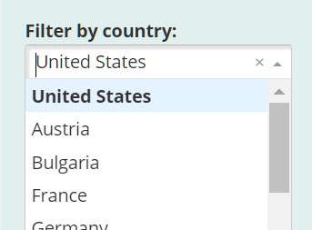
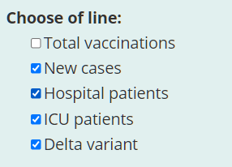
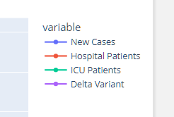
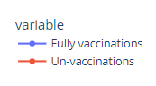
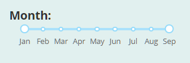
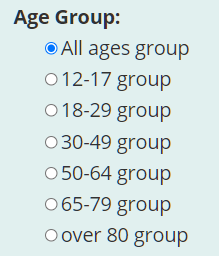
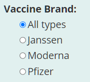
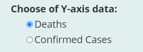

# Application  Manual

## 1. Introduction

This Application user Manual contains all the information for the user to explore the website. 

- Web application URL: https://groupl-dash-app.herokuapp.com/
- Source code: https://github.gatech.edu/mxia38/groupL_dash_app_cs6440_Fall202 
- User could open the website with a web browser 
- A brief introduction is listed at the top of the website
- The data reference is listed at the bottom

## 2. Authors:

The website is developed by cs6440Fall2021 – Group L: Mengna Xia, Xinying Jia, Zuodong Jian

## 3. How to use

### 3.1 Select from country dropdown menu
Users could choose the countries from the dropdown menu, 

then the “Statistical box section”, “Normalized Value Line Chart”, and “Granger Causality in Time series” will change accordingly. 
 
### 3.2 Select Line in Chart

Users could choose to see the specified value by clicking the options below: 

  
 or
  

  or

  
### 3.3 Select time range

Users could choose to see the specified time range by slide the slide bar:

 
### 3.4	Select from radio button

the for bottom figure, the user could choose from the radio button of the age/vaccine group/ Y-axis data:

  and   

  and  

