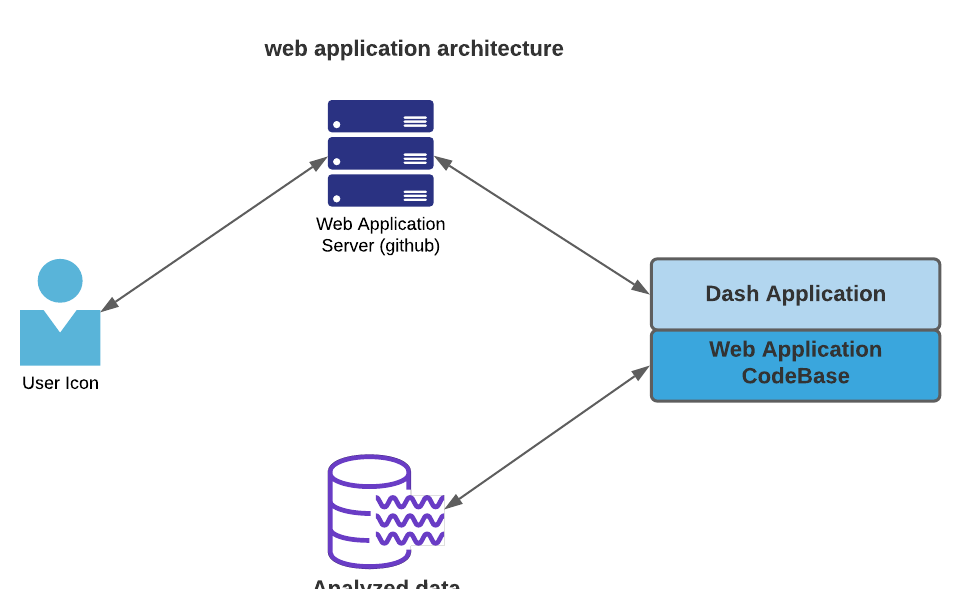
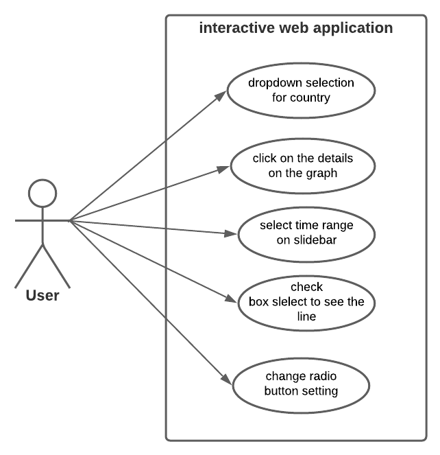
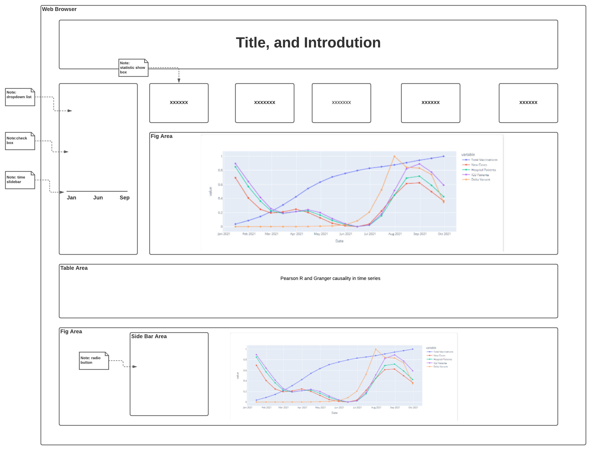

# Design Document

### Version Description

Web Applicatin v18: lastest update

**Author**: \<cs6440 Fall 2021 Group L - Zuodong Jiang, Xinying Jia, Mengan Xia>

## 1. Brief Introduction

We will create a web application, so the user could explore the analysis result of Covid-19 vaccine effectiveness. 

1. The user could select a total of 9 counties, then the statical value such as numbers of total vaccinations, new cases, hospital patients, ICU patients, and delta variant will be displayed. 
2. At the same time, the user could also explore a normalized value-line chart for the selected country. The user could select which line to include or exclude. And the time range could be customized as well.
3. The Pearson R-value and Granger Causality in the time series of the selected county are listed and display our analysis result.
4. Besides, we studied Immune of age groups/vaccine brands vs. deaths/confirmed cases. The user could explore the finger in different categories. 

## 2. Dataset

- “owid-covid-data (1).csv” and “covid-variants.csv”, were collected from [“Our World in Data”](https://ourworldindata.org/)
- “Rates_of_COVID-19_Cases_or_Deaths_by_Age_Group_and_Vaccination_Status.csv” was collected from [CDC](https://data.cdc.gov/Public-Health-Surveillance/Rates-of-COVID-19-Cases-or-Deaths-by-Age-Group-and/3rge-nu2a).
- “Austria.csv”, “Bulgaria.csv”, “France.csv”, “Germany.csv”, “Italy.csv”, “Netherlands.csv”, “Portugal.csv”, “Spain.csv”, “United States.csv” are datasets for Pearson R and Granger causality in time series and were generated using [stat.ipynb](https://github.gatech.edu/mxia38/groupL_dash_app_cs6440_Fall2021/blob/master/stat.ipynb) file.

## 3. Design Consideration

### 3.1 Assumptions
- This  web application is designed to run on web browser.
- Development will happen in Python JDK and Jupyter Notebook.
- User knows how to use web browser.
- User has some background knowledge of the COVID-19 pandemic.
- User know how to read statistical line chart, and table

### 3.2 Constraints

- Development tool : PyCharm and Jupyter Notebook
- Programing Language: Python 3.9
- Libraries: pandas,statsmodels.tsa.stattools, dash, plotly, datetime
- Language: English

### 3.3 System Environment
#### Hardware
- There is no specific requirement on hardware

#### 3.4 Software
- Web browser

## 4. Design Diagram

### 4.1 Architectural Design

### 4.2 Use Cases:

### 4.3 Page mockup

## 5. Deployment

The web application is design to be deployed on Heroku.com. See detail at [special instructions.md](https://github.gatech.edu/mxia38/groupL_dash_app_cs6440_Fall2021/blob/master/Final%20Delivery/Special%20Instructions.md)

