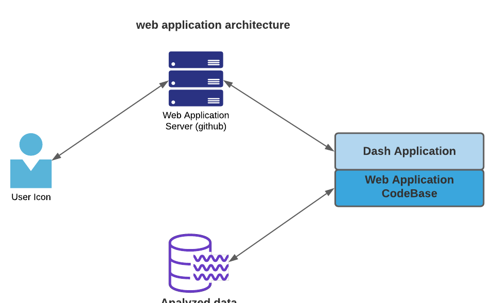
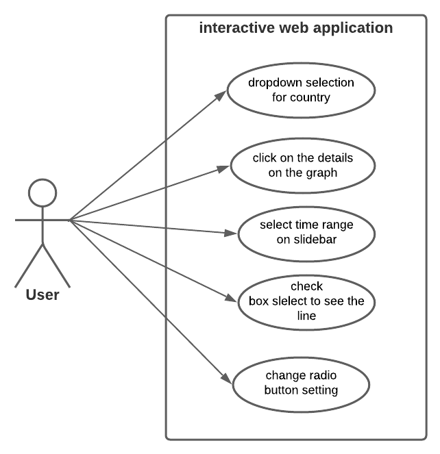
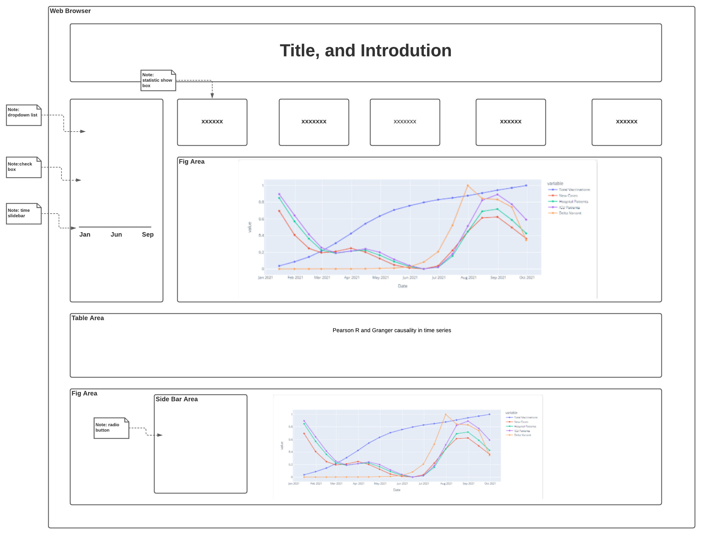

# Design Document

### Version Description

For Web Applicatin v 15: lastest update

**Author**: \<cs6440 Fall 2021 Group L>

## 1 Design Consideration

### 1.1 Assumptions
- This  web application is designed to run on web browser.
- Development will happen in Python JDK and Jupyter Notebook.
- User knows how to use web browser.
- User has some background knowledge of the COVID-19 pandemic.

### 1.2 Constraints

- Development tool : PyCharm and Jupyter Notebook
- SDK: Android SDK
- Programing Language: Python 3.9
- Language: English

### 1.3 System Environment
#### Hardware
- There is no specific requirement on hardware

#### 1.4 Software
- Web browser

## 2 Design Diagram

### 2.1 Architectural Design

Diagram above shows the architectural of the web application.

### 2.2 Use Cases:

### 2.3 Page mockup

## 3 Deployment

The web application is design to be deployed on Heroku.com. See detail at [special instructions.md](https://github.gatech.edu/mxia38/groupL_dash_app_cs6440_Fall2021/blob/master/Final%20Delivery/Special%20Instructions.md)

## 3 Dataset

- “owid-covid-data (1).csv” and “covid-variants.csv”, were collected from “Our World in Data” (https://ourworldindata.org/)
- “Rates_of_COVID-19_Cases_or_Deaths_by_Age_Group_and_Vaccination_Status.csv” was collected from CDD, (https://data.cdc.gov/Public-Health-Surveillance/Rates-of-COVID-19-Cases-or-Deaths-by-Age-Group-and/3rge-nu2a)
- “Austria.csv”, “Bulgaria.csv”, “France.csv”, “Germany.csv”, “Italy.csv”, “Netherlands.csv”, “Portugal.csv”, “Spain.csv”, “United States.csv” are datasets for Pearson R and Granger causality in time series and were generated using stat.ipynb file.

