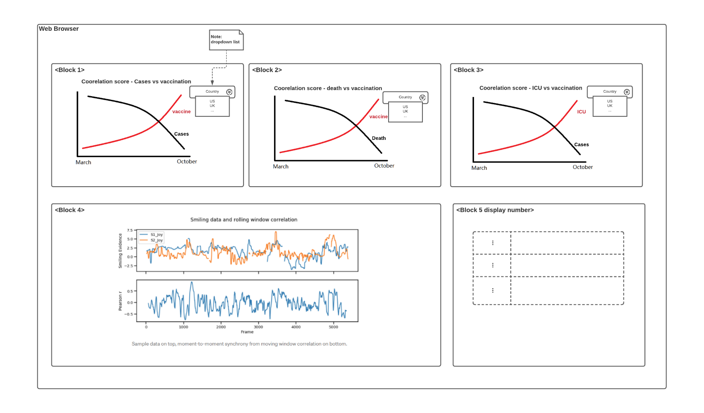
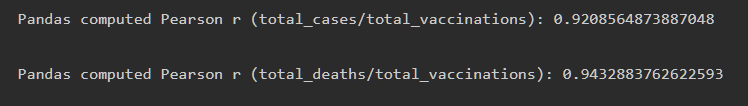
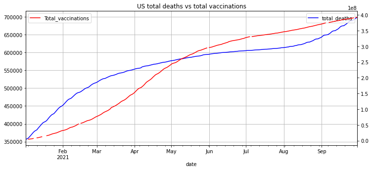
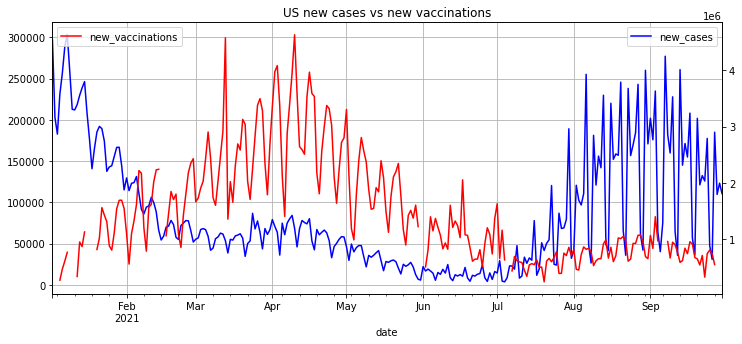
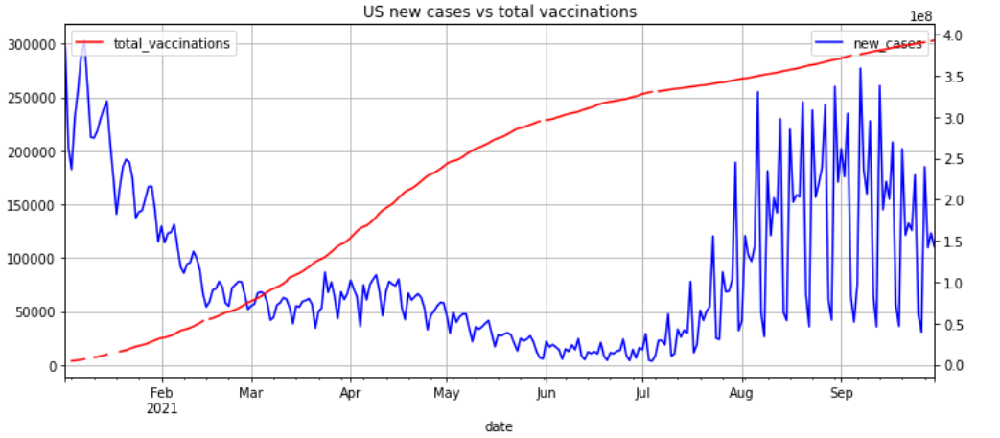

# Practicum Sprint #1

## 1	PROBLEM (TOPIC)
In this study, we will use data visualization and modeling tools to analyze the public COVID-19 related health care data. Our goal is to provide real-world evidence for several major controversial topics about COVID-19 coronavirus:  
1. Evaluation of COVID-19 vaccine effectiveness based on US COVID-19 related health care data. 2. Evaluation of COVID-19 vaccine effectiveness on different populations (race, age, gender) 3. Analysis of the impact of state-specific COVID-19 related policies on virus infection.

### 1.1	Specify if this is your own/team idea or a mentor project
This is a team idea.

### 1.2	Provide a List of Your Top 10 Topics

1.	**Our topic: COVID-19 Vaccine Effective Analysis and Visualization;**
2.	NLP tools to search COVID-19 publication from PubMed (team idea);
3.	NLP Data Pipeline with unstructured clinical data (Jaewoo Park)
4.	FHIR IG testing with Inferno Framework (John Bender, Reece Adamson)
5.	Combating Nutritional Deficiencies (Tia Pope)
6.	Interactive FHIR Lessons (Elizabeth Shivers)
7.	FHIR IG Analytics (John Bender, Reece Adamson)
8.	COVID-19 Remote Vital Signs Monitoring (Raj Vansia)
9.	Medication Reminder App (Pillbox) (Ross Raiff)
10.	ALMA (Tia Pope)

## 2	AREA OF FOCUS
 We will be focusing on the Special Topics of Covid-19.
## 3	BACKGROUND AND SIGNIFICANCE
“COVID-19 is an infectious disease caused by SARS-CoV-2” (Coronavirus) . The syndrome caused by the disease varies, some develop into severe acute respiratory syndrome which needs intensive unit care or cause death; some only have mild symptoms such as a fever, cough, loss of smell and taste…, while some do not even develop any noticeable symptoms (COVID-19).

On March 11, 2020, WHO declares COVID-19 a pandemic. A year later, the US public started to inoculate with the COVID-19 vaccine. Starting late 2020, an accelerated distribution of vaccines has begun, with several vaccines granted emergency use authorization by the U.S. FDA (Wiersinga, 2020). So far, about 51.1% of the total pollution have received full doses of vaccinations of COVID (COVID-19) . From what we have learned as yet, the vaccines are not 100% effective at preventing infection, which means a person who is fully vaccinated might still get COVID-19. However, it seems the vaccine is helping on preventing the infected individuals from developing into serious illness or even causing death. There is still a huge population that is deeply skeptical about the safety and effectiveness of the mRNA vaccine and causing them reluctant to receive the inoculation (Robson, 2021). As the death rate of COVID-19 keeps on ramping, a lot of different voices are still questioning the effectiveness of the vaccine.

In this project, we will evaluate the effectiveness of the COVID-19 vaccine in preventing disease and death by using big data analysis and modeling tools.  And we will display our result in an interactive interface that the user could set up filters and parameters to see the details of the result.

## 4	PROPOSED SOLUTION OR IDEA

1.	A time-series analysis will be conducted by comparing the COVID-19 infection number versus the vaccination number, to evaluate if vaccination effectively reduces the infections over time. 
2.	Hospitalization data and vaccination data will be analyzed and plotted, to evaluate if vaccination could reduce the risk of infections.
3.	The death with vaccination data will be compared to see if vaccines could truly reduce the death. 
4.	All the comparison results will be analyzed by different US states, to see if there are any differences. There is a possibility that the differences are caused by the states’ local policies. Further, 
5.	All the comparisons results will be analyzed by different Races/Ethnicity, to evaluate the effectiveness of vaccinations by Race/Ethnicity. 
6.	All the data/analysis/comparisons will be present with an interactive interface as a visualization.  The users will be able to set up filters and parameters to see the details of our study.

## 5	COMPLEXITY OR EFFORT

- Collecting vaccination data by different times, states, races/ethnicity, and ages completely could be challenged. We expected some data may not be available. 
- By now, we believe that four major types of data are needed in this project: the number of vaccinations, the number of COVID-19 infections, and the number of COVID-19 related hospitalizations, and the number of COVID-19 death. More data might be collected as the project move forward. 
- The data should be collected and analyzed in a time-series manner from March to July 2021, and futher analyzed by different US states,and by different groups of the population (race/ethnicity/age). 
- As the public health care of COVID-19 related data will be used, there is no privacy and security issue. 
- Python Dash/plotly is selected to build interactive web applications for result display. The user could define the limitations with the button, and the redefine-result will be present. We don’t have much experience with the framework. So, it might take us some time to get onto the right track.
## 6	TENTATIVE TEAM MEMBERS & ROLES (IF APPLICABLE)
We have 3 members in the team: Zuodong Jiang, Xinying Jia, Mengna Xia. 

Roles for the project: 

 6.1 Project Manager: Zuodong Jiang
Set up meeting agenda and time, make sure all member finish their tasks on time based on the Gantt table. 

6.2 Analyst:  
- Zuodong Jiang: 
Collect data from ourwoldindata.org
Person r and Granger causality in time series analysis
- Xinying Jia:
Collect data from CDC.org
Analyze the immune of age groups/vaccine brands vs. deaths/confirmed cases
- Mengna Xia:
Analyze the normalized data of total vaccinations vs. new cases/hospital patients/ICU patients
The sum and mean values for the statistical box

6.3 Developer: 
- Mengna Xia
The overall design and layout of the web application
The coding of interactive function parts
- Xinying Jia:
Building the group git repo
Develop the “fully vaccinations vs. un-vaccinations” figure and its sidebar
- Zuodong Jiang
Develop the dash table to display the correlation and granger results.

6.4 Quality assurance: Mengna Xia

6.5 Deployment: Mengna Xia
Deploy the web application on heroku.com

## 7	REFERENCES
- Coronavirus. (n.d.). Retrieved from who.int: https://www.who.int/health-topics/coronavirus#tab=tab_1
- COVID-19. (n.d.). Retrieved from wikipedia.org: https://en.wikipedia.org/wiki/COVID-19
- FDA. (2020, Novermber 11). Emergency use authorization for vaccines explained. Retrieved from fda.gov: https://www.fda.gov/vaccines-blood-biologics/vaccines/emergency-use-authorization-vaccines-explained
- Robson, D. (2021, Jul 20). Why some people don't want a Covid-19 vaccine. Retrieved from bbc.com: https://www.bbc.com/future/article/20210720-the-complexities-of-vaccine-hesitancy
- Wiersinga, W. J. (2020). Pathophysiology, transmission, diagnosis, and treatment of coronavirus disease 2019 (COVID-19): a review. Jama, 782-793

# Practicum Sprint #2

## PROJECT DESIGN 
Project Summary
The US public started to receive COVID19 vaccines around March 2021 and about 51.1% of the total population have received full doses of vaccinations now (COVID-19, 2021). However, there is still a huge population that is deeply skeptical about the safety and effectiveness of the mRNA vaccine and causing them reluctant to receive the inoculation (Robson, 2021)
In this study, we will use data visualization and modeling tools to analyze the public COVID-19 related health care data. Our goal is to provide real-world evidence for several major controversial topics about COVID-19 coronavirus:  
First, vaccine effectiveness will be quantified synchrony correlation between time series data by trying different statistical methods. We propose higher vaccination effectiveness can be proven by a lower correlation between vaccination and infection data. Then we will evaluate COVID-19 vaccine effectiveness based on COVID-19 related health care data.  Finally, we will display our data on the interactive webpage, so the reader could have a better visualization of our conclusion. 

## Tools and Technology
-	Jupyter Notebook will be used as an IDE.
-	Python libraries used for data extraction, cleaning, and transformation: Pandas, NumPy. 
-	Python libraries sci-kit learn used for machine learning model, script. stats used for correlation analysis
-	Python Plotly libraries will be used to select to build interactive web applications for data visualization. 
-	The interactive application will be uploaded and hosted in one free plotly account. 
-	Code will share between members on the GitHub repo

## Data Sources
The covid-19 data was collected from “Our World in Data” (Coronavirus Pandemic (COVID-19)). The original data sources for each data are as follows:
-	Confirmed cases and deaths data comes from the COVID-19 Data Repository by the Center for Systems Science and Engineering (CSSE) at Johns Hopkins University (JHU) (COVID-19 Content Portal);
-	Hospitalizations and intensive care unit (ICU) admissions data comes from the European Centre for Disease Prevention and Control (ECDC) for a select number of European countries, and government sources are from Switzerland, the UK, the US, Canada, Israel...
-	The data of COVID-19 testing and vaccinations against COVID-19 are collected by the Our World in Data team from official reports;
-	The data for other variables are collected from a variety of sources (United Nations, World Bank, Global Burden of Disease, Blavatnik School of Government, etc.).

## Diagrams

Figure 1—	Web Application Architecture

Figure 2—	Use case diagram for web application

Figure 3—	screen mockups

## REFERENCES
- Coronavirus Pandemic (COVID-19). (n.d.). Retrieved from ourworldindata.org: https://ourworldindata.org/coronavirus
- COVID-19. (2021, Oct. 21). Retrieved from wikipedia.org: https://en.wikipedia.org/wiki/COVID-19
- COVID-19 Content Portal. (n.d.). Retrieved from CSSE: https://systems.jhu.edu/research/public-health/ncov/
- ECDC. (n.d.). Retrieved from ecdc.europa.eu/en: https://www.ecdc.europa.eu/en
- Robson, D. (2021, Jun 20). Why some people don't want a Covid-19 vaccine. Retrieved from bbc.com: https://www.bbc.com/future/article/20210720-the-complexities-of-vaccine-hesitancy

## Appendix

### IMPLEMENTATION PLAN

##### Project Tasks
-	Sprint 1: proposal of the project, background, content, potential risk. 
-	Sprint 2:  web application starting design, including the detailed plan, schedule, diagram, mockup, implementation plan, etc.
-	Sprint 3: data collecting, cleaning, and transformation.
-	Sprint 4: data analysis to find a good statistics metric to quantify synchrony between time-series correlation between covid-19 infection and vaccination data. 
-	Sprint 5: finalize the data analysis, to see if we still could achieve our original goal, do we need to add/remove some of our original goals.  
-	Sprint 6: start to build a web application.
-	Sprint 7: combine the web application with analyzed data.
-	Sprint 8: QA with test cases.
-	Sprint 9: deploy the web application.
-	Sprint 10：working on the presentation

##### Project Timeline
Table 1 —	Project schedule

| Week # | Week of | Task | Reading/Videos |
| ------ | ------  | -----| ------  |
| 5 | 09/20/2021 |	Choosing project topic and areas |	|
| 6 | 09/27/2021 | | |		
| 7 | 10/04/2021 | | |		
| 8	| 10/11/2021 | Web application starting design, including the detailed plan, schedule, diagram, mockup, implementation plan, etc. |	https://www.coursera.org/specializations/software-design-architecture |
| 9 | 10/18/2021 |Data collecting, cleaning, and transformation.|	1.	https://github.com/owid/covid-19-data/tree/master/public/data 2. 	https://pandas.pydata.org/docs/reference/api/pandas.DataFrame.to_numpy.html |
|10 | 10/25/2021 |Data analysis to find a good metric to measure the correlation between covid-19 infection and vaccination data.|1. https://scikit-learn.org/stable/ 2. https://www.youtube.com/watch?v=0B5eIE_1vpU | 
|11| 11/01/2021| Finalize the data analysis, to see if we still could achieve our Original goal, do we need to add/remove some of our original goals. | |
|12| 11/08/2021| Build a web application.| https://plotly.com/python/|
|13| 11/15/2021| Combine the web application with analyzed data.| |
|14| 11/22/2021| QA with test cases.| |
|15| 11/29/2021| Deploy the web application.| |
|16| 12/06/2021| Prepare presentation| |
|17| 12/13/2021| Finalize and submit all the files| |
			
##### Needs/ Risks
1.	There is a limited time (less than 10 weeks).
2.	Communication between team members, and with the mentor.
3.	Data source:
	- Covid-19 data from specific countries with some time range could be missing. 
	- The quality of data needs to be validated. Only high-quality data should be selected for the study. 
4.	Data analysis
	- It is critical to find a correct method to measure the reverse correlation between infection and vaccination. 
	- Team members need to learn how to use different python libraries for data analysis, visualization.
5.	Developing and publishing the web application
	- Team members need to learn how to create a Plotly visualization and embed it on websites. 

# Practicum Sprint #3

## 1	ACCOMPLISHMENT
### 1.1	Data Collection
As we planned, we collect most of our COVID19 data from “Our World in Data” (Coronavirus Pandemic (COVID-19)). There are a total of 65 columns, including location, toatal_cases, new_cases, weekly_icu_admissions, etc…. There are a total of 60402 rows of data, and 233 unique locations (countries) as well. Data was saved in CSV format.
### 1.2	Data cleaning and transformation
1.	In a Juypter Notebook file, data was loaded with Pandas data frame;
2.	We further created time-series data, which ranges from 01/01/2021 to 10/01/2021, since this is the major vaccination time range for the US, and most other countries start after the US.
3.	The date columns are replaced with indexes for easy handling in the fu-ture. 
4.	8 countries were picked for initial data analysis for initial comparison. These countries include the US, South Africa, Japan, UK, Germany, Aus-tralia, Canada, Italy.

### 1.3	Exploratory Data Analysis for Time Series Data:
We start some initial data exploration, only US data selected to display below:
1.	Calculate the Pearson Score (Pearson correlation coefficient) between in-fection data and vaccination data (US data).  When Pearson’s r is close to zero, the less likely the two data sets are correlated. 

Figure 1—	Pearson’s r values

2.	Plot vaccination data with infection data for visualization. 

Figure 2—	US total cases vs total vaccinations

Figure 3—	US total deaths vs total vaccinations

Figure 4—	US new cases vs new vaccinations

## 2	CHALLENGES ENCOUNTERED
	The biggest challenge is the data trend is not as we expected. From the US data, we could see that as the total vaccination increased, the total cases de-creased between Jan 2021 - Aug 2021, so as the same trend in the “total death vs total vaccinations”. However, the total cases and total death increase rapid-ly after Aug 2021. We notice the same trend appeared within other counties.  We assume this might be caused either by the spreading of delta-variant, or the starting of school. 
	As we mentioned above, there might be more factors to affect the trend and how to separate and refine the condition and data point would be another challenge. 
	Pearson’s r score is used to display the linear correlation between two sets of data (wiki). We found that only Pearson’s r score to explain the correlation might be too native. We need to figure out some other ways to get a better correlation. 

## 3	PLANS MOVING FORWARD
As we mentioned the challenges in section 2, our plan to move forward is as be-low: 
	Analyze more countries. The countries we picked right now only focus on bigger counties with better economic conditions. We will try to explore some less developed countries to see we could have more findings.
	More correlation between different data and select the best infection data for correlation analysis. For example, we could compare the new cases to the to-tal vaccinations. Besides, all the data points are collected daily, we could transform the data into weekly to get a smoother plot. 
	Refine the factors for further analysis.
	Start to explore plotly.

## 4	REFERENCES
Coronavirus Pandemic (COVID-19). (n.d.). Retrieved from ourworldindata.org: https://ourworldindata.org/coronavirus
Pearson correlation coefficient. (n.d.). Retrieved from wikipedia.org: https://en.wikipedia.org/wiki/Pearson_correlation_coefficient

# Practicum Sprint #4

## 1	ACCOMPLISHMENT
When exploring the data from the last sprint initially, we found the data trend is different from what we expected. We then further explored this in this sprint. Be-low we only select US data for the explanation.
### 1.1	Data analysis on the new cases and total vaccinations in the US
After discussion, we think new cases vs total vaccinations would be a good rep-resentation to achieve our goal. We notice the trend is what we expected before July. However, the new cases went up after July, and we guess it might be caused by the delta variant. 

Figure 1—	US new cases vs. total vaccinations
### 1.2	COVID variants new cases over time in different countries
To prove our hypothesis, we collected COVID variants data from ourworldinda-ta.org. The data sets include location, data, variant, total number and percent of each variant, and the total number of samples sequence biweekly. Only delta was selected for analysis, and we notice there are some correlations between the delta variant and the new cases, see figure 3 in the appendix for more details.
### 1.3	Data analysis in new cases and delta variant cases over the vaccinations
To plot the two different datasets together, data transformation was done by: 1. limited time range from 01/01/2021 to 10/16/2021. 2. resampled on a biweekly ba-sis. We could see that the delta is the trigger of the uproar of new cases from mid-June in figure 3.
Figure 2—	Total vaccinations vs. new cases vs. delta
1.4	Calculate the correlations
A series of cross-correlations between different covid data at different time rang-es were calculated listed in table 1 in the appendix, and we believe this is a good representation of our hypothesis. 
The results indicate that vaccination has an overall negative effect on new cases (correlation = -0.2687 after January and correlation= -0.76 before June). Delta vari-ant accounted for the most of new cases (correlation = 0.9034 after January and correlation = 0.9 after June). However, the correlation analysis does not give a clear indication that vaccination harms delta variant (correlation =0.59 after June). This will be what our further analysis will focus on. 
2	CHALLENGES ENCOUNTERED
	The biggest challenge is the data quality issue. Ascertain the type of data in some countries is not available. US data is the best by far the most complete. However, for a lot of other countries, the data is either missing a huge part, or the plot shows an unexplainable trend. 
	Now we have made big progress.  However, after July 2021, the delta variant broke out. Is the COVID vaccine effective for the delta variant, which is the most important variant in the world? It is still unclear.  We need to analyze deeply to answer this question.  
	As we mentioned above, our analysis can be conducted using other factors. For example, we can pick several representative countries and compare the COVID data of these countries. However, the data from different countries may not be in the same format, which will be another challenge.
	Until now our data show the daily new case of COVID is related to the total number of full vaccinations. However, do full vaccinations cause the decrease of daily new cases of COVID? Does the COVID vaccine make the spread un-der control? These questions remain challengeable.  
3	PLANS MOVING FORWARD
As we mentioned the challenges in section 2, our plan to move forward is as be-low: 
1.	Perform a deep analysis of vaccination effectiveness. Now we only ana-lyze the relation between new daily cases vs. the total number of vaccina-tions. Some reports showed that vaccination may make the illness less se-vere. To test whether or not, we will try to include other factors, like ICU and death number to check the effectiveness of the COVID vaccine. 
2.	Compare the covid data between different countries. The countries we picked right now only focus on the US. We will try to explore both devel-oped and developing countries. We expect to see a difference in the data plot as most developed countries have better vaccination than developing countries. 
3.	Finalize the data analysis, and explore if we could add more plots to achieve our original goal
4.	 Explore if we could do a causality study in time-series data
5.	Start the initial implementation of Dash/Plotly
4	REFERENCES
Coronavirus Pandemic (COVID-19). (n.d.). Retrieved from ourworldindata.org: https://ourworldindata.org/coronavirus
Pearson correlation coefficient. (n.d.). Retrieved from wikipedia.org: https://en.wikipedia.org/wiki/Pearson_correlation_coefficient
5	APPENDIX

Figure 3—	Percent of delta vs. date

Table 1 —	Cross-correlation
Time Range	United State	Cross-Correlation
01/01/2011 and 10/01/2021
	total_vac vs. new cases:	-0.2687
	total_vac vs. delta new cases	0.5962
	new cases vs. delta new cases	0.9034
 01/01/2011 and 06/01/2021
	total_vac vs. new cases:	-0.76
	total_vac vs. delta new cases	0.81
	new cases vs. delta new cases	-0.49
06/01/2011 and 10/01/2021
	total_vac vs. new cases:	0.79
	total_vac vs. delta new cases	0.59
	new cases vs. delta new cases	0.90

