# Practicum Sprint #1

## 1	PROBLEM (TOPIC)
In this study, we will use data visualization and modeling tools to analyze the public COVID-19 related health care data. Our goal is to provide real-world evidence for several major controversial topics about COVID-19 coronavirus:  
1. Evaluation of COVID-19 vaccine effectiveness based on US COVID-19 related health care data. 2. Evaluation of COVID-19 vaccine effectiveness on different populations (race, age, gender) 3. Analysis of the impact of state-specific COVID-19 related policies on virus infection.

### 1.1	Specify if this is your own/team idea or a mentor project
This is a team idea.

### 1.2	Provide a List of Your Top 10 Topics

1.	**Our topic: COVID-19 Vaccine Effective Analysis and Visualization;**
2.	NLP tools to search COVID-19 publication from PubMed (team idea);
3.	NLP Data Pipeline with unstructured clinical data (Jaewoo Park)
4.	FHIR IG testing with Inferno Framework (John Bender, Reece Adamson)
5.	Combating Nutritional Deficiencies (Tia Pope)
6.	Interactive FHIR Lessons (Elizabeth Shivers)
7.	FHIR IG Analytics (John Bender, Reece Adamson)
8.	COVID-19 Remote Vital Signs Monitoring (Raj Vansia)
9.	Medication Reminder App (Pillbox) (Ross Raiff)
10.	ALMA (Tia Pope)

## 2	AREA OF FOCUS
 We will be focusing on the Special Topics of Covid-19.
## 3	BACKGROUND AND SIGNIFICANCE
“COVID-19 is an infectious disease caused by SARS-CoV-2” (Coronavirus) . The syndrome caused by the disease varies, some develop into severe acute respiratory syndrome which needs intensive unit care or cause death; some only have mild symptoms such as a fever, cough, loss of smell and taste…, while some do not even develop any noticeable symptoms (COVID-19).

On March 11, 2020, WHO declares COVID-19 a pandemic. A year later, the US public started to inoculate with the COVID-19 vaccine. Starting late 2020, an accelerated distribution of vaccines has begun, with several vaccines granted emergency use authorization by the U.S. FDA (Wiersinga, 2020). So far, about 51.1% of the total pollution have received full doses of vaccinations of COVID (COVID-19) . From what we have learned as yet, the vaccines are not 100% effective at preventing infection, which means a person who is fully vaccinated might still get COVID-19. However, it seems the vaccine is helping on preventing the infected individuals from developing into serious illness or even causing death. There is still a huge population that is deeply skeptical about the safety and effectiveness of the mRNA vaccine and causing them reluctant to receive the inoculation (Robson, 2021). As the death rate of COVID-19 keeps on ramping, a lot of different voices are still questioning the effectiveness of the vaccine.

In this project, we will evaluate the effectiveness of the COVID-19 vaccine in preventing disease and death by using big data analysis and modeling tools.  And we will display our result in an interactive interface that the user could set up filters and parameters to see the details of the result.

## 4	PROPOSED SOLUTION OR IDEA

1.	A time-series analysis will be conducted by comparing the COVID-19 infection number versus the vaccination number, to evaluate if vaccination effectively reduces the infections over time. 
2.	Hospitalization data and vaccination data will be analyzed and plotted, to evaluate if vaccination could reduce the risk of infections.
3.	The death with vaccination data will be compared to see if vaccines could truly reduce the death. 
4.	All the comparison results will be analyzed by different US states, to see if there are any differences. There is a possibility that the differences are caused by the states’ local policies. Further, 
5.	All the comparisons results will be analyzed by different Races/Ethnicity, to evaluate the effectiveness of vaccinations by Race/Ethnicity. 
6.	All the data/analysis/comparisons will be present with an interactive interface as a visualization.  The users will be able to set up filters and parameters to see the details of our study.

## 5	COMPLEXITY OR EFFORT

- Collecting vaccination data by different times, states, races/ethnicity, and ages completely could be challenged. We expected some data may not be available. 
- By now, we believe that four major types of data are needed in this project: the number of vaccinations, the number of COVID-19 infections, and the number of COVID-19 related hospitalizations, and the number of COVID-19 death. More data might be collected as the project move forward. 
- The data should be collected and analyzed in a time-series manner from March to July 2021, and futher analyzed by different US states,and by different groups of the population (race/ethnicity/age). 
- As the public health care of COVID-19 related data will be used, there is no privacy and security issue. 
- Python Dash/plotly is selected to build interactive web applications for result display. The user could define the limitations with the button, and the redefine-result will be present. We don’t have much experience with the framework. So, it might take us some time to get onto the right track.
## 6	TENTATIVE TEAM MEMBERS & ROLES (IF APPLICABLE)
We have 3 members in the team: Zuodong Jiang, Xinying Jia, Mengna Xia. 

Roles for the project: 

 6.1 Project Manager: Zuodong Jiang
Set up meeting agenda and time, make sure all member finish their tasks on time based on the Gantt table. 

6.2 Analyst:  
- Zuodong Jiang: 
Collect data from ourwoldindata.org
Person r and Granger causality in time series analysis
- Xinying Jia:
Collect data from CDC.org
Analyze the immune of age groups/vaccine brands vs. deaths/confirmed cases
- Mengna Xia:
Analyze the normalized data of total vaccinations vs. new cases/hospital patients/ICU patients
The sum and mean values for the statistical box

6.3 Developer: 
- Mengna Xia
The overall design and layout of the web application
The coding of interactive function parts
- Xinying Jia:
Building the group git repo
Develop the “fully vaccinations vs. un-vaccinations” figure and its sidebar
- Zuodong Jiang
Develop the dash table to display the correlation and granger results.

6.4 Quality assurance: Mengna Xia

6.5 Deployment: Mengna Xia
Deploy the web application on heroku.com

## 7	REFERENCES
- Coronavirus. (n.d.). Retrieved from who.int: https://www.who.int/health-topics/coronavirus#tab=tab_1
- COVID-19. (n.d.). Retrieved from wikipedia.org: https://en.wikipedia.org/wiki/COVID-19
- FDA. (2020, Novermber 11). Emergency use authorization for vaccines explained. Retrieved from fda.gov: https://www.fda.gov/vaccines-blood-biologics/vaccines/emergency-use-authorization-vaccines-explained
- Robson, D. (2021, Jul 20). Why some people don't want a Covid-19 vaccine. Retrieved from bbc.com: https://www.bbc.com/future/article/20210720-the-complexities-of-vaccine-hesitancy
- Wiersinga, W. J. (2020). Pathophysiology, transmission, diagnosis, and treatment of coronavirus disease 2019 (COVID-19): a review. Jama, 782-793

# Practicum Sprint #2

## PROJECT DESIGN 
Project Summary
The US public started to receive COVID19 vaccines around March 2021 and about 51.1% of the total population have received full doses of vaccinations now (COVID-19, 2021). However, there is still a huge population that is deeply skeptical about the safety and effectiveness of the mRNA vaccine and causing them reluctant to receive the inoculation (Robson, 2021)

In this study, we will use data visualization and modeling tools to analyze the public COVID-19 related health care data. Our goal is to provide real-world evidence for several major controversial topics about COVID-19 coronavirus: 
 
First, vaccine effectiveness will be quantified synchrony correlation between time series data by trying different statistical methods. We propose higher vaccination effectiveness can be proven by a lower correlation between vaccination and infection data. Then we will evaluate COVID-19 vaccine effectiveness based on COVID-19 related health care data. Finally, we will display our data on the interactive webpage, so the reader could have a better visualization of our conclusion. 

## Tools and Technology
-	Jupyter Notebook will be used as an IDE.
-	Python libraries used for data extraction, cleaning, and transformation: Pandas, NumPy. 
-	Python libraries sci-kit learn used for machine learning model, script. stats used for correlation analysis
-	Python Plotly libraries will be used to select to build interactive web applications for data visualization. 
-	The interactive application will be uploaded and hosted in one free plotly account. 
-	Code will share between members on the GitHub repo

## Data Sources
The covid-19 data was collected from “Our World in Data” (Coronavirus Pandemic (COVID-19)). The original data sources for each data are as follows:
-	Confirmed cases and deaths data comes from the COVID-19 Data Repository by the Center for Systems Science and Engineering (CSSE) at Johns Hopkins University (JHU) (COVID-19 Content Portal);
-	Hospitalizations and intensive care unit (ICU) admissions data comes from the European Centre for Disease Prevention and Control (ECDC) for a select number of European countries, and government sources are from Switzerland, the UK, the US, Canada, Israel...
-	The data of COVID-19 testing and vaccinations against COVID-19 are collected by the Our World in Data team from official reports;
-	The data for other variables are collected from a variety of sources (United Nations, World Bank, Global Burden of Disease, Blavatnik School of Government, etc.).

## Diagrams

Figure 1—	Web Application Architecture

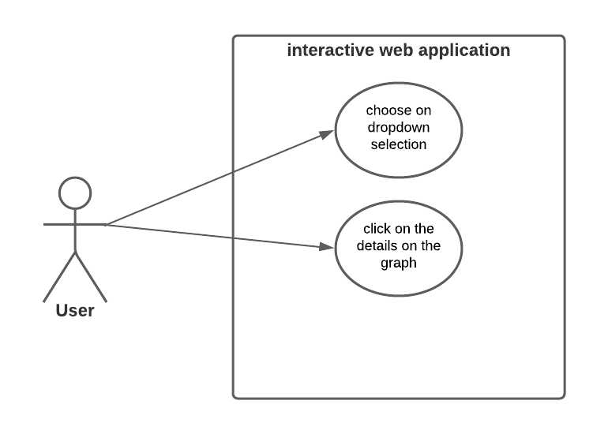

Figure 2—	Use case diagram for web application

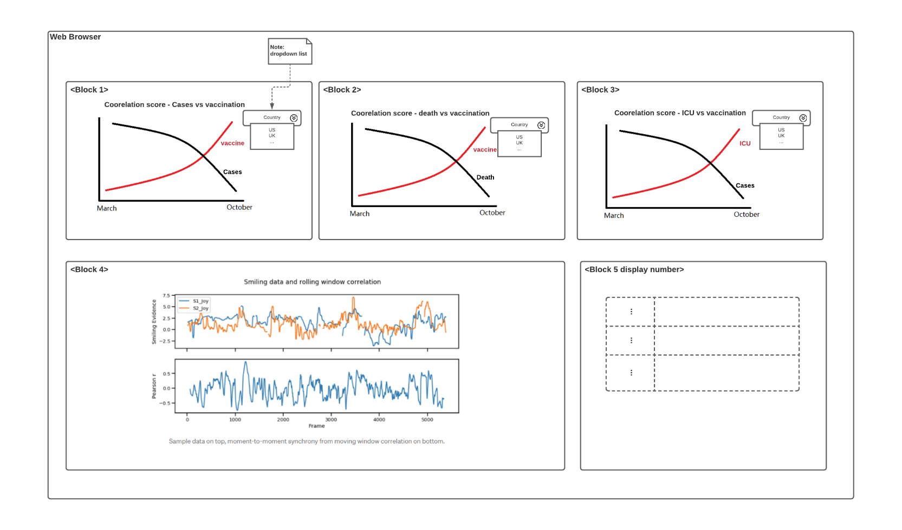

Figure 3—	screen mockups

## REFERENCES
- Coronavirus Pandemic (COVID-19). (n.d.). Retrieved from ourworldindata.org: https://ourworldindata.org/coronavirus
- COVID-19. (2021, Oct. 21). Retrieved from wikipedia.org: https://en.wikipedia.org/wiki/COVID-19
- COVID-19 Content Portal. (n.d.). Retrieved from CSSE: https://systems.jhu.edu/research/public-health/ncov/
- ECDC. (n.d.). Retrieved from ecdc.europa.eu/en: https://www.ecdc.europa.eu/en
- Robson, D. (2021, Jun 20). Why some people don't want a Covid-19 vaccine. Retrieved from bbc.com: https://www.bbc.com/future/article/20210720-the-complexities-of-vaccine-hesitancy

## Appendix

### IMPLEMENTATION PLAN

##### Project Tasks
-	Sprint 1: proposal of the project, background, content, potential risk. 
-	Sprint 2:  web application starting design, including the detailed plan, schedule, diagram, mockup, implementation plan, etc.
-	Sprint 3: data collecting, cleaning, and transformation.
-	Sprint 4: data analysis to find a good statistics metric to quantify synchrony between time-series correlation between covid-19 infection and vaccination data. 
-	Sprint 5: finalize the data analysis, to see if we still could achieve our original goal, do we need to add/remove some of our original goals.  
-	Sprint 6: start to build a web application.
-	Sprint 7: combine the web application with analyzed data.
-	Sprint 8: QA with test cases.
-	Sprint 9: deploy the web application.
-	Sprint 10：working on the presentation

##### Project Timeline
Table 1 —	Project schedule

| Week # | Week of | Task | Reading/Videos |
| ------ | ------  | -----| ------  |
| 5 | 09/20/2021 |	Choosing project topic and areas |	|
| 6 | 09/27/2021 | | |		
| 7 | 10/04/2021 | | |		
| 8	| 10/11/2021 | Web application starting design, including the detailed plan, schedule, diagram, mockup, implementation plan, etc. |	https://www.coursera.org/specializations/software-design-architecture |
| 9 | 10/18/2021 |Data collecting, cleaning, and transformation.|	1.	https://github.com/owid/covid-19-data/tree/master/public/data 2. 	https://pandas.pydata.org/docs/reference/api/pandas.DataFrame.to_numpy.html |
|10 | 10/25/2021 |Data analysis to find a good metric to measure the correlation between covid-19 infection and vaccination data.|1. https://scikit-learn.org/stable/ 2. https://www.youtube.com/watch?v=0B5eIE_1vpU | 
|11| 11/01/2021| Finalize the data analysis, to see if we still could achieve our Original goal, do we need to add/remove some of our original goals. | |
|12| 11/08/2021| Build a web application.| https://plotly.com/python/|
|13| 11/15/2021| Combine the web application with analyzed data.| |
|14| 11/22/2021| QA with test cases.| |
|15| 11/29/2021| Deploy the web application.| |
|16| 12/06/2021| Prepare presentation| |
|17| 12/13/2021| Finalize and submit all the files| |
			
##### Needs/ Risks
1.	There is a limited time (less than 10 weeks).
2.	Communication between team members, and with the mentor.
3.	Data source:
	- Covid-19 data from specific countries with some time range could be missing. 
	- The quality of data needs to be validated. Only high-quality data should be selected for the study. 
4.	Data analysis
	- It is critical to find a correct method to measure the reverse correlation between infection and vaccination. 
	- Team members need to learn how to use different python libraries for data analysis, visualization.
5.	Developing and publishing the web application
	- Team members need to learn how to create a Plotly visualization and embed it on websites. 

# Practicum Sprint #3

## 1	ACCOMPLISHMENT
### 1.1	Data Collection
As we planned, we collect most of our COVID19 data from “Our World in Data” (Coronavirus Pandemic (COVID-19)). There are a total of 65 columns, including location, toatal_cases, new_cases, weekly_icu_admissions, etc…. There are a total of 60402 rows of data, and 233 unique locations (countries) as well. Data was saved in CSV format.
### 1.2	Data cleaning and transformation
1.	In a Juypter Notebook file, data was loaded with Pandas data frame;
2.	We further created time-series data, which ranges from 01/01/2021 to 10/01/2021, since this is the major vaccination time range for the US, and most other countries start after the US.
3.	The date columns are replaced with indexes for easy handling in the fu-ture. 
4.	8 countries were picked for initial data analysis for initial comparison. These countries include the US, South Africa, Japan, UK, Germany, Aus-tralia, Canada, Italy.

### 1.3	Exploratory Data Analysis for Time Series Data:
We start some initial data exploration, only US data selected to display below:

Calculate the Pearson Score (Pearson correlation coefficient) between in-fection data and vaccination data (US data).  When Pearson’s r is close to zero, the less likely the two data sets are correlated. 

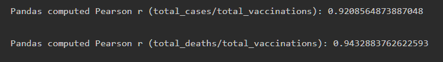

Figure 1—	Pearson’s r values

2.	Plot vaccination data with infection data for visualization. 

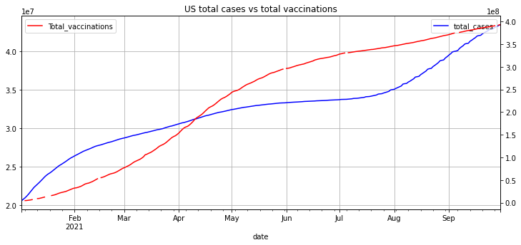

Figure 2—	US total cases vs total vaccinations

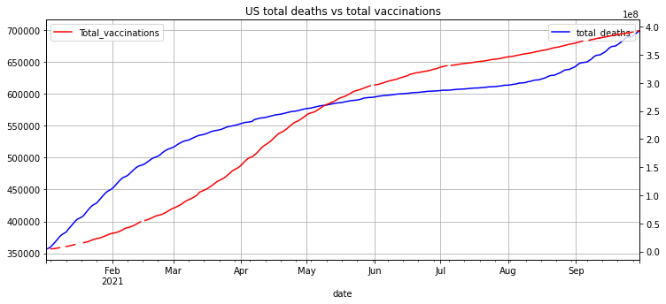

Figure 3—	US total deaths vs total vaccinations

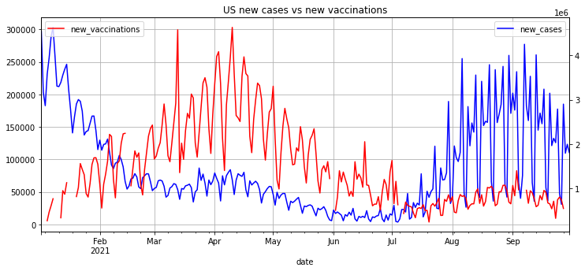

Figure 4—	US new cases vs new vaccinations

## 2	CHALLENGES ENCOUNTERED
	The biggest challenge is the data trend is not as we expected. From the US data, we could see that as the total vaccination increased, the total cases de-creased between Jan 2021 - Aug 2021, so as the same trend in the “total death vs total vaccinations”. However, the total cases and total death increase rapid-ly after Aug 2021. We notice the same trend appeared within other counties.  We assume this might be caused either by the spreading of delta-variant, or the starting of school. 

	As we mentioned above, there might be more factors to affect the trend and how to separate and refine the condition and data point would be another challenge. 

	Pearson’s r score is used to display the linear correlation between two sets of data (wiki). We found that only Pearson’s r score to explain the correlation might be too native. We need to figure out some other ways to get a better correlation. 

## 3	PLANS MOVING FORWARD
As we mentioned the challenges in section 2, our plan to move forward is as be-low: 

- Analyze more countries. The countries we picked right now only focus on bigger counties with better economic conditions. We will try to explore some less developed countries to see we could have more findings.
- More correlation between different data and select the best infection data for correlation analysis. For example, we could compare the new cases to the to-tal vaccinations. Besides, all the data points are collected daily, we could transform the data into weekly to get a smoother plot. 
- Refine the factors for further analysis.
- Start to explore plotly.

## 4	REFERENCES
Coronavirus Pandemic (COVID-19). (n.d.). Retrieved from ourworldindata.org: https://ourworldindata.org/coronavirus
Pearson correlation coefficient. (n.d.). Retrieved from wikipedia.org: https://en.wikipedia.org/wiki/Pearson_correlation_coefficient

# Practicum Sprint #4

## 1	ACCOMPLISHMENT
When exploring the data from the last sprint initially, we found the data trend is different from what we expected. We then further explored this in this sprint. Be-low we only select US data for the explanation.
### 1.1	Data analysis on the new cases and total vaccinations in the US
After discussion, we think new cases vs total vaccinations would be a good rep-resentation to achieve our goal. We notice the trend is what we expected before July. However, the new cases went up after July, and we guess it might be caused by the delta variant. 

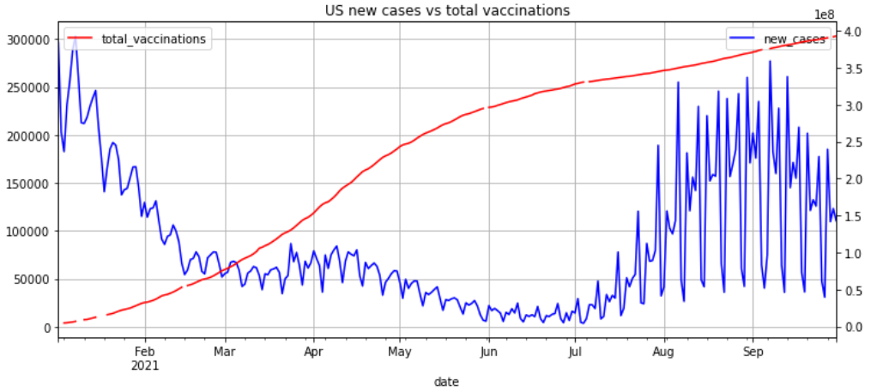

Figure 1—	US new cases vs. total vaccinations
### 1.2	COVID variants new cases over time in different countries
To prove our hypothesis, we collected COVID variants data from ourworldinda-ta.org. The data sets include location, data, variant, total number and percent of each variant, and the total number of samples sequence biweekly. Only delta was selected for analysis, and we notice there are some correlations between the delta variant and the new cases, see figure 3 in the appendix for more details.
### 1.3	Data analysis in new cases and delta variant cases over the vaccinations
To plot the two different datasets together, data transformation was done by: 1. limited time range from 01/01/2021 to 10/16/2021. 2. resampled on a biweekly ba-sis. We could see that the delta is the trigger of the uproar of new cases from mid-June in figure 3.

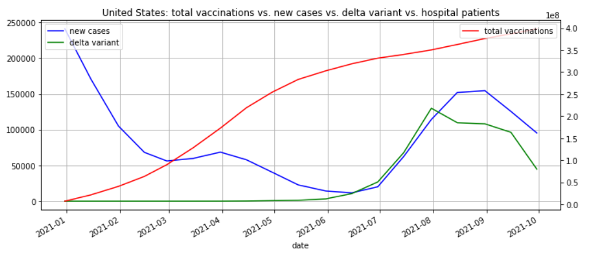

Figure 2—	Total vaccinations vs. new cases vs. delta

### 1.4	Calculate the correlations
A series of cross-correlations between different covid data at different time rang-es were calculated listed in table 1 in the appendix, and we believe this is a good representation of our hypothesis. 
The results indicate that vaccination has an overall negative effect on new cases (correlation = -0.2687 after January and correlation= -0.76 before June). Delta vari-ant accounted for the most of new cases (correlation = 0.9034 after January and correlation = 0.9 after June). However, the correlation analysis does not give a clear indication that vaccination harms delta variant (correlation =0.59 after June). This will be what our further analysis will focus on. 

## 2	CHALLENGES ENCOUNTERED
- The biggest challenge is the data quality issue. Ascertain the type of data in some countries is not available. US data is the best by far the most complete. However, for a lot of other countries, the data is either missing a huge part, or the plot shows an unexplainable trend. 
- Now we have made big progress.  However, after July 2021, the delta variant broke out. Is the COVID vaccine effective for the delta variant, which is the most important variant in the world? It is still unclear.  We need to analyze deeply to answer this question.  
- As we mentioned above, our analysis can be conducted using other factors. For example, we can pick several representative countries and compare the COVID data of these countries. However, the data from different countries may not be in the same format, which will be another challenge.
- Until now our data show the daily new case of COVID is related to the total number of full vaccinations. However, do full vaccinations cause the decrease of daily new cases of COVID? Does the COVID vaccine make the spread un-der control? These questions remain challengeable.  
## 3	PLANS MOVING FORWARD
As we mentioned the challenges in section 2, our plan to move forward is as be-low: 
1.	Perform a deep analysis of vaccination effectiveness. Now we only ana-lyze the relation between new daily cases vs. the total number of vaccina-tions. Some reports showed that vaccination may make the illness less se-vere. To test whether or not, we will try to include other factors, like ICU and death number to check the effectiveness of the COVID vaccine. 
2.	Compare the covid data between different countries. The countries we picked right now only focus on the US. We will try to explore both devel-oped and developing countries. We expect to see a difference in the data plot as most developed countries have better vaccination than developing countries. 
3.	Finalize the data analysis, and explore if we could add more plots to achieve our original goal
4.	 Explore if we could do a causality study in time-series data
5.	Start the initial implementation of Dash/Plotly
## 4	REFERENCES
- Coronavirus Pandemic (COVID-19). (n.d.). Retrieved from ourworldindata.org: https://ourworldindata.org/coronavirus
- Pearson correlation coefficient. (n.d.). Retrieved from wikipedia.org: https://en.wikipedia.org/wiki/Pearson_correlation_coefficient
## 5	APPENDIX

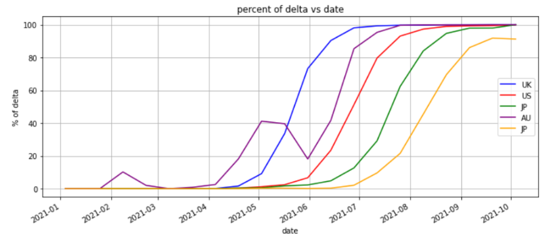

Figure 3—	Percent of delta vs. date

Table 1 —	Cross-correlation

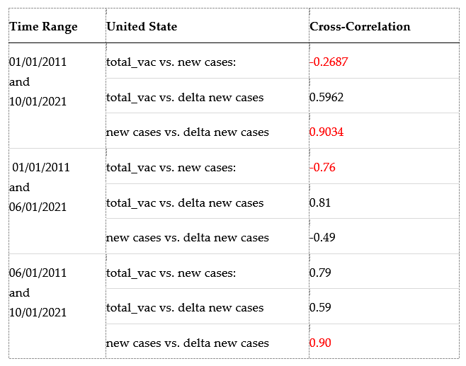

# Practicum Sprint #5

## 1	ACCOMPLISHMENT
### 1.1	Data analysis updates

Our previous correlation result indicates that vaccination has an overall negative effect on new cases (correlation = -0.2687 after January and correlation= -0.76 before June) (figure 1); Delta variants are the main reason for the burst of Covid cases since June 2021(figure 1).  In this report, we are going to test how vaccination impacts death and hospitalization.  Then we are going to use statistical methods to test if there is a causal relationship between vaccination and covid infection. 

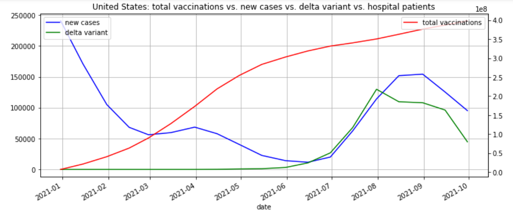

Figure 1—	Total vaccinations vs. new cases vs number of deltas

First, the following data was included in the analysis: the number of the new deaths caused by covid infection (new death), the number of patients in ICU (icu_patients), the number of patients in hospitalization (hosp_patients). We will still include delta data because we think the delta variant might still affect the result.

For data visualization, we have used two methods to make these data in the same magnitudes: we tried to plot with “new_deaths” (absolute value), “total_vaccinations_per_hundred” (percent), and “perc_sequences” (percent)  the hospital and ICU patient per million(figure2); we also try to normalize the data by min_max normalization(figure3). 

The normalization results clearly show that the number of hospitalizations and ICU have the same trends (figure3) as new cases (figure1). As a result,  it indicates that vaccinations also have a negative correlation to hospitalization and ICU cases. 

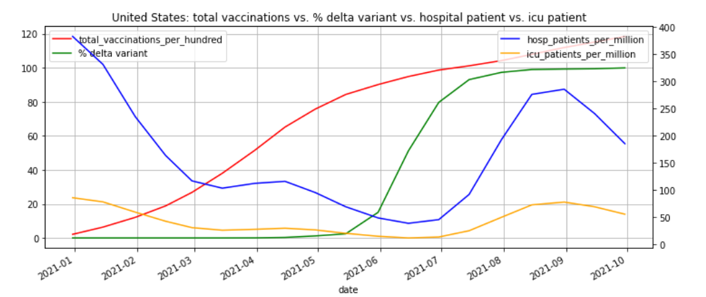

Figure 2—	better visualization for total vaccination vs new death vs % of delta variant

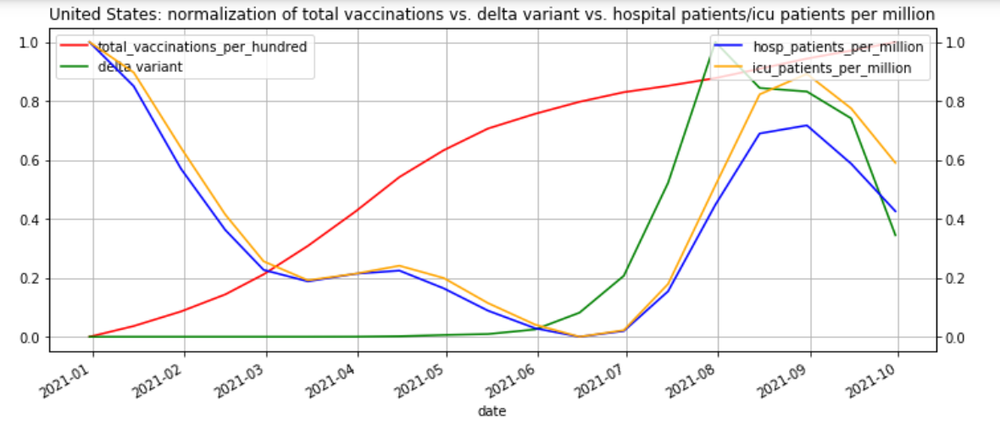

Figure 3—	Normalization of total vaccination vs new death vs  of delta variant vs. hospital and ICU patients per million

Second, while we do see the negative correlation between Vaccination and covid infection, correlation does not imply causation. To support our hypothesis that vaccination is the cause of the reduced covid infection, we are using  Granger Causality in Time Series (Granger Causality in Time Series – Explained using Chicken and Egg problem)

Granger test was performed by considering 4th lag as optimal lag for now. When p-value is low(<0.05), A does not granger cause B; whereas when p-value is high (>0.05), A does granger cause B. Table1 shows that total_vaccinations granger causes the new case(p_value=0.5407); whereas new cases do not granger cause total_vaccinations (p_value = 0.0475). In other words, vaccination came first and not the new cases. Following the same methods, vaccination granger causes hospitalization (p_value = 0.08 and 0.64 by two directions) and ICU (p_value = 0.0135 and 0.51 by two directions). However, whether vaccination causes new_death is unknown (p_value = 0.1199 and 0.29 by two directions), as there is no significant difference between p_value by the two directions (partial result in figure 7 in appendix). 

Table 1 —	Table 1 Augmented Dickey-Fuller Test (ADF test)
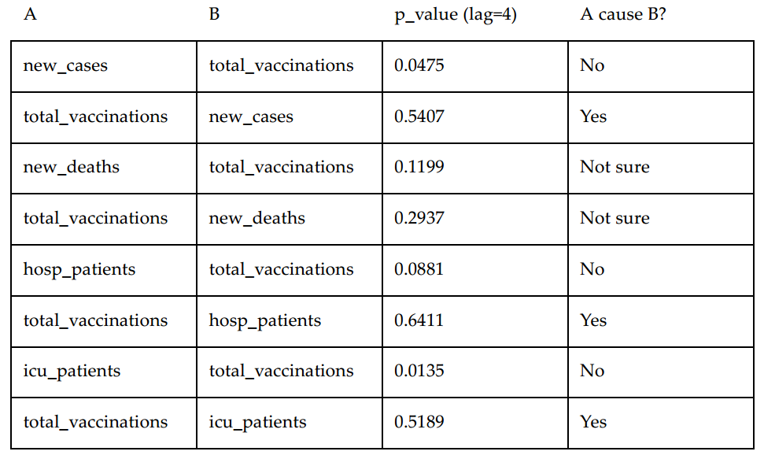

Our results are promising to show that there is a causal relationship between vaccination and covid infection and vaccinations usually come first and are the cause of covid infection (new_cases, hospitalization, and ICU). 

Third, We also analyze other countries besides the US. We collected COVID19 related data from 233 countries in the whole world and found out that there are 43 countries (figure 8 in appendix) where the full vaccination percentage is over 60%.

We analyze and visualize these COVID19 related data (partial result in figure 9 in appendix). The results showed that vaccinations have a negative correlation to new cases and death cases in most countries even if every country has different policies, vaccines, population and climates. 

### 1.2	Connect with mentor
No. We read the comments from the mentor of our last sprint, and the comment is positive. On the other side, we have already listed out our plan, and we are still working on the data analysis part of the projects, as in the previous two sprints. If we progress too slow or the results are questionable, we think TA will let us know. 

## 2	CHALLENGES ENCOUNTERED
1.	One challenge to plot figure 2 and figure 3 is the number magnitudes (figure 4 and 5 in appendix). Total vaccinations, new death, number of the delta, hospital patients, and ICU patients are all in different magnitudes, which makes them hard to plot together. To generate better visualization, we need to normalize the data with the following methods: 
dfnorm = (dfmerge - dfmerge.min()) / (dfmerge.max()-dfmerge.min())
2.	To do the Granger causality test, the data needs to be stationary. We use an ADF test with the stationary of the data (figure 6 in appendix). After try different transformations, we found for ['total_vaccinations', 'new_cases', 'new_deaths'], resample (Resample python list with pandas) at ‘10D’ and for ['total_vaccinations', 'hosp_patients', 'icu_patients'], resample at ‘18D’ works. We then further use the ffill() (pandas.DataFrame.ffill) function to fill the NA with the mean value. By now, the data is ready for the Granger causality test. 
3.	We don't have any further needs for the data analysis part. We think there is promising data to support our initial proposal. And we will have several images and statistical results to display on the web application.
## 3	PLANS MOVING FORWARD
1.	We spent around 20 hours this week, and a little bit more on last week, about 25 hours.
2.	As we planned in sprint 2, we will start to build a web application next week using the Dash/Plotly framework. We are planning to spend 15 -20 hours next week on the initial implementation.
## 4	REFERENCES
- Granger Causality in Time Series – Explained using Chicken and Egg problem. (n.d.). Retrieved from analyticsvidhya.com: https://www.analyticsvidhya.com/blog/2021/08/granger-causality-in-time-series-explained-using-chicken-and-egg-problem/
- pandas.DataFrame.ffill. (n.d.). Retrieved from pandas.pydata.org: https://pandas.pydata.org/docs/reference/api/pandas.DataFrame.ffill.html
- Resample python list with pandas. (n.d.). Retrieved from stackoverflow.com: https://stackoverflow.com/questions/43478822/resample-python-list-with-pandas

# Practicum Sprint #6

## 1	ACCOMPLISHMENT
As we planned, this week we are starting to build our data visualization application with Dash/plotly. 
-	we have built a basic layout (figure 1) that includes a title, a side navigation bar, a five-column area to display numbers, a figure area, and a statistic result area. The layout uses an external .css file (etpinard).

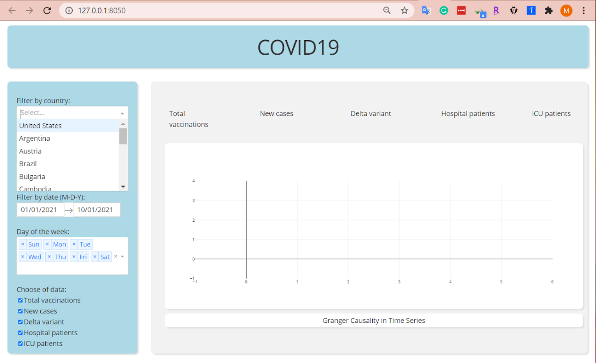

Figure 1—	Dash layout and code

1.2 We have tried “plotly.graph_objects” (Graph Objects in Python) to make an interactive graph and host these graph components from the built-in “dash_core_components” package (Dash Core Components). We are hoping to plot our own data using these tools next week. 

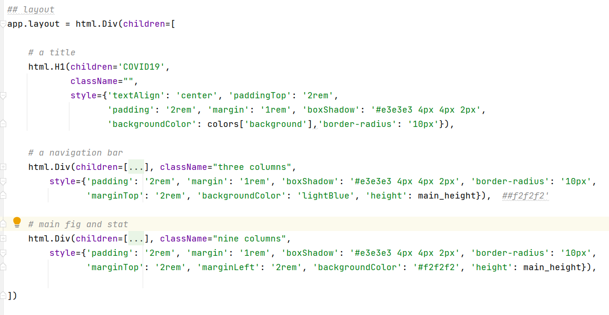

Figure 2—	Code for the layout

1.3 We analyze COVID19 data of the USA deeply. We compared new cases and death of fully vaccination population and the vaccination population and proved that vaccines reduce the risk of getting COVID-19 and protect people from severe illness.

 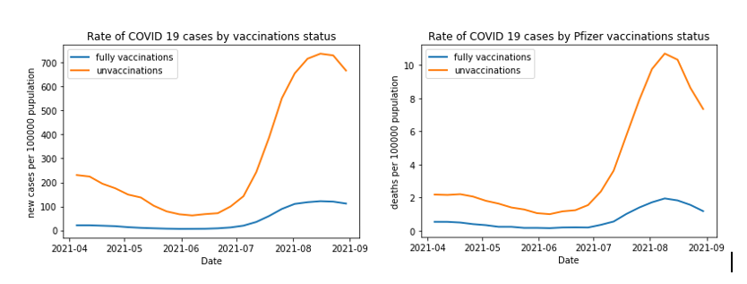

Figure 3—	Vaccination rate

## 2	CHALLENGES ENCOUNTERED

2.1 The dash layout needs some fine adjustment; some components still have alignment problems. We also tried “dash_bootstrap_components” (Dash Bootstrap Components), which also needs some learning for the implementation.

2.2 We are still working on how to make an interactive graph with line plots by dropdown function and implement the data graph into the layout. Hopefully, we could finish this part next week.

## 3	PLANS MOVING FORWARD

3.1 We spend about 20 hours this week on the initial web application layout, simple plotly implementation. We spend about 20 hours last week, as it is the part to finalize our data analysis. 

3.2 As we planned in sprint 2, we are moving into combining the web application with analyzed data. We expect about 20 -25 hours next week.

## 4	REFERENCES
- Dash Bootstrap Components. (n.d.). Retrieved from https://dash-bootstrap-components.opensource.faculty.ai/
- Dash Core Compoents. (n.d.). Retrieved from https://dash.plotly.com/dash-core-components
- etpinard. (n.d.). PLotly.js. Retrieved from codepen.io: https://codepen.io/chriddyp/pen/bWLwgP.css
- Graph Objects in Python. (n.d.). Retrieved from plotly.com: https://plotly.com/python/graph-objects/

# Practicum Sprint #7

## 1	ACCOMPLISHMENT
As we planned, this week we are starting to build our data visualization with analyzed data using the Dash web application created by plotly.
 
The structure and content of our web app were firstly designed by following the CSS and HTML components from the template (“Part 3. Basic Callbacks | Dash for Python Documentation | Plotly”). Then, in order to create interactive line charts, we have implemented several dash functions including “Dropdown by countries”, “Checklist by categories”, “Slider by Months” (demo).  Our main analysis figure and statistical data can be updated with the “callback function”. 

We are still working on an analysis to calculate vaccine effectiveness scores based on the Granger Causality and the correlation score. We plan to use a dashing ta-ble to display it by different date range. 

Below is the link for a short application demo video:
https://youtu.be/PZjyliNIZ5Y

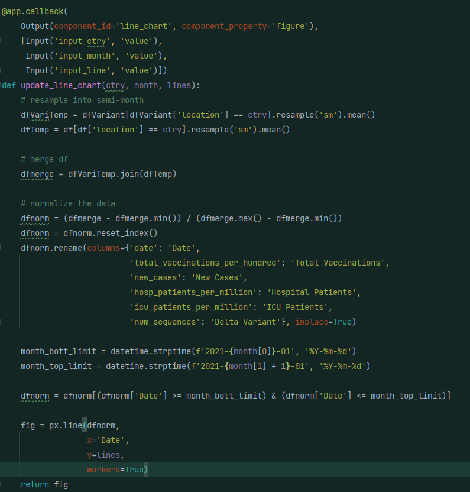

## 2	CHALLENGES ENCOUNTERED
- There is a learning curve of the “@app.callbak” function of Dash/plotly.
- Our data come from different original .csv files. In order to plot different val-ues together, we need to merge the file and do some index handling.
- There are several filters to filter the data, we have to set up the right sequence to combine them together.
- How to properly represent the vaccine effectiveness using our existing statis-tical analysis based on our current data is a big challenge. The study will be continued in our next sprint. 

## 3	PLANS MOVING FORWARD

- Implement the Granger Causality and the correlation score table
- QA the application for any mistakes.
- We spent about 25 hours this week on the interactive implementation. We spent about 20 hours last week. 
- As we planned in sprint 2, we are moving into the table implementation and QA. We expect about 15 hours next week.

## 4	REFERENCES
- “Part 3. Basic Callbacks | Dash for Python Documentation | Plotly.” Dash Plotly, https://dash.plotly.com/basic-callbacks. Accessed 19 November 2021.
- Demo link - https://youtu.be/PZjyliNIZ5Y

# Practicum Sprint #8

## 1	ACCOMPLISHMENT
As we planned, we are focusing on the final implementation, and debugging of our web application. 

We add two main parts other than the line chart implemented last week:

- Pearson r correlation and the granger causality:
 
 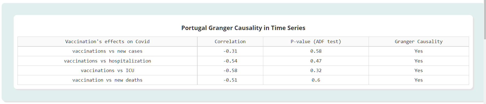
 
Figure 1 - dash table

- Fully vaccinations vs un-vaccinations
 
 
 
Figure 2 - newly add dash plot

- Youtube link of final implementation:

https://youtu.be/FicLsrCadyc

Several bugs were found:

1.	The data for the statistic is in different scopes. For example, total vaccination is defined as “Total number of COVID-19 vaccination doses administered”, however, for ICU patients, hospital patients, and new cases are defined in a “given day”. As a result, the total vaccination value should use the mean value, while the other 3 should use the total value respectively. 

2.	To make the web application appearance look better, we have to modify some of the margin settings of the div containers. 

## 2	CHALLENGES ENCOUNTERED

2.1	It takes time to modify the web application setting. And as we have more figures and tables to put in, we need to update our web application display. For example, the statistic boxes were removed from the fig container into a separate container (appendix figure 3)
2.2	We need to manually generate data for correlation and Granger causality base on the country. 
2.3	The plot of vaccinations vs un-vaccinations implemented differently from the normalized plot
2.4	It is better to only have one callback function (appendix fig 5), otherwise the app might have a data loading problem.
## 3	PLANS MOVING FORWARD

3.1	We spent about 15 hours this week on implementation and debugging the web application. We spent about 15 hours last week, as it is the part to finalize our data analysis. 
3.2	As we planned in sprint 2, we are moving into the deployment of the web application. We expect about 5 hours next week.
3.3	We will start to prepare the final submission. 

## 4	APPENDIX

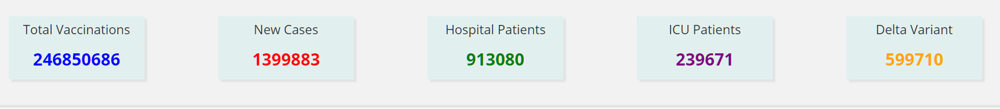
 
Figure 3 - Statistic boxes

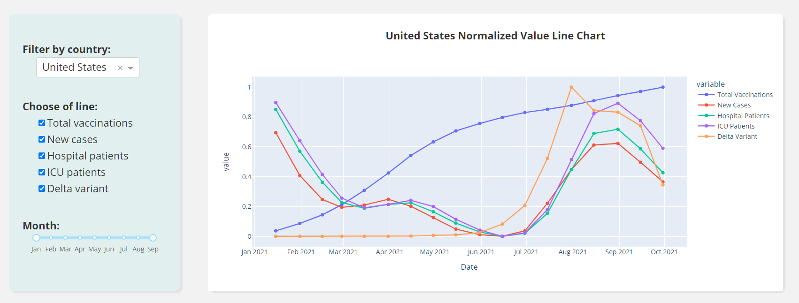
 
Figure 4 - Normalized figure
 
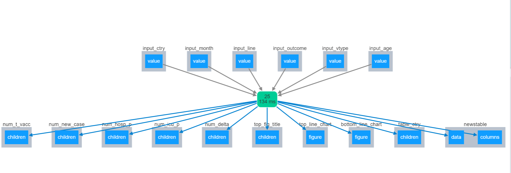
  
Figure 5 - Callback function in the app

# Practicum Sprint #9
 
## 1.	ACCOMPLISHMENT
As we planned, this week we are focusing on the deployment of our interactive web application. 

1.	Make some modifications to the appearance of the web application. We add-ed a conditional radio button for the bottom figures. 
2.	We use Heroku for our deployment, Like Azure, Heroku is a cloud platform as a service supporting several programming languages.
3.	we have successfully deployed our app, below is the link: https://groupl-dash-app.herokuapp.com/

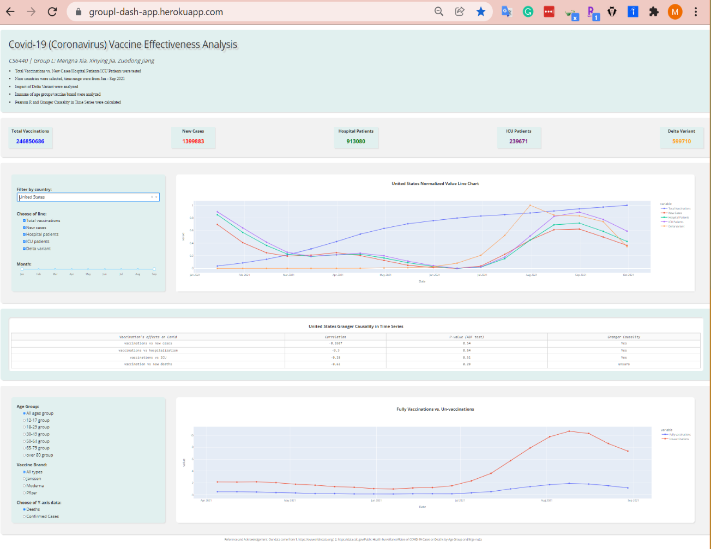

Figure 1—	deployment on heroku.com

## 2.	CHALLENGES ENCOUNTERED
- Some code snippet needs to update to correct deployment. For example:

 

Figure 2—	Necessary code snippet for deployment

- The data-input section needs to be put into the main function scope, other-wise, the data will not be loaded correctly on Heroku.
-Only load the necessary libraries into the requirements.txt file, otherwise there might take a long time to upload, and the compatible problems as well.

## 3.	PLANS MOVING FORWARD
- We spent about 8 hours this week on deployment and its troubleshooting. We spent about 15 hours last week, as it is the part to finalize our web application implementation. 
- As we planned in sprint 2, we are moving into the final submission. We plan about 20 hours for preparing the files and making the presentation. 
## 4.	REFERENCES
- Heroku- www.heroku.com

## 5.	APPENDIX
[Special Instructions of deployment](https://github.gatech.edu/mxia38/groupL_dash_app_cs6440_Fall2021/blob/master/Final%20Delivery/Special%20Instructions.md)

